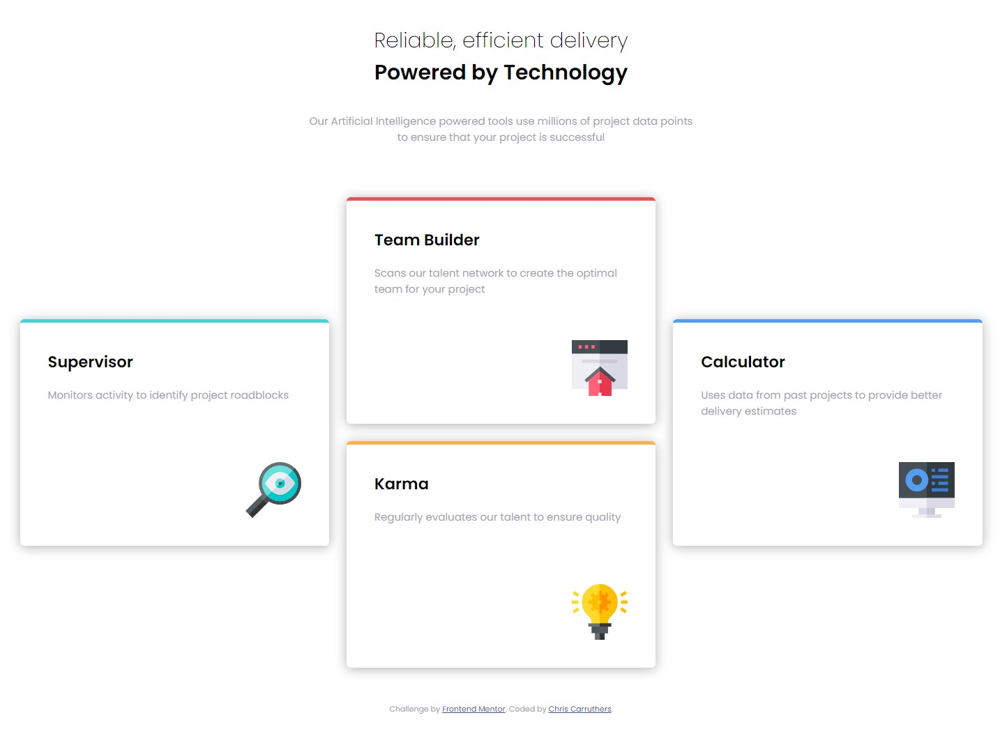
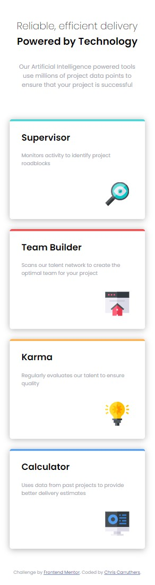

# Frontend Mentor - Four card feature section solution

This is a solution to the [Four card feature section challenge on Frontend Mentor](https://www.frontendmentor.io/challenges/four-card-feature-section-weK1eFYK). Frontend Mentor challenges help you improve your coding skills by building realistic projects.

## Table of contents

- [Overview](#overview)
  - [The challenge](#the-challenge)
  - [Screenshot](#screenshot)
- [My process](#my-process)
  - [Built with](#built-with)
  - [What I learned](#what-i-learned)
- [Author](#author)
- [Acknowledgments](#acknowledgments)

## Overview

### The challenge

Users should be able to:

- View the optimal layout for the site depending on their device's screen size

### Screenshot

### Links

- Solution URL: [Add solution URL here](https://your-solution-url.com)
- Live Site URL: [Add live site URL here](https://your-live-site-url.com)

## My process

### Built with

- Microsoft Edge
- VS Code
- Semantic HTML5 markup
- CSS custom properties
- Flexbox
- Grid
- sass/scss

### What I learned

- How to manipulate the CSS grid to be responsive with @media breakpoints.
- Using sass/scss functions with props.

## Author

- Website - Christopher Carruthers (https://github.com/Chris971991)
- Frontend Mentor - @Chris971991 (https://www.frontendmentor.io/profile/Chris971991)

## Acknowledgments

I would like to put a word out for all the devs at Front End Mentor and thank them for creating a platform for people who want a challenge whilst learning Web Developement.
